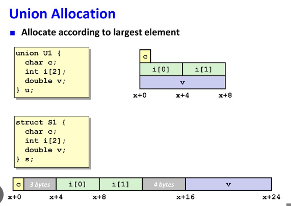

# 공용체

## 공용체의 정의와 선언
### 공용체의 정의
공용체를 정의하는 방법은 키워드 struct 대신 union 을 사용한다는 점을 제외하면 구조체와 똑같다. 구조체 st_t 와 공용체 un_t 는 똑같은 멤버로 구정되어 있다.

```c
struct st_t {
  char ch;
  int i;
  long long ll;
};

union un_t {
  char ch;
  int i;
  long long ll;
}
```

공용체 변수를 선언하는 방법 역시 구조체 변수와 동일하다.

```c
struct st_t s;
union un_t u;
```

그러나 구조체와 달리 공용체는 모든 멤버가 같은 저장공간을 공유하기 때문에, 위에 선언된 변수 s 와 u 가 차지가하는 저장공간의 크가가 다르다. 아래는 변수 s와 u의 저장공간을 그림으로 비교한 것으로 구조체 변수 s는 각 멤버가 고유의 저장공간을 갖지만, 공용체 변수 u는 같은 저장공간을 모든 멤버가 공유한다.

```
[ 1 ]
구조체 : struct st_t

---------------- st_t : 16 byte ( 1 + 3(패딩) + 4 + 8 )
char ch : 1byte : 0x100
int i   : 4byte : 0x101 ~ 0x103
long long ll : 8byte : 0x104 ~ 0x111
----------------

[ 2 ]
유니온 : union ut_t

---------------- ut_t : 8 byte ( sizeof(ll) )
char ch
int i 
long long ll
---------------

printf("%d" , sizeof(st_t)); // 16 = 1 + 3(패딩) + 4 + 8
printf("%d" , sizeof(ut_t)); // 8 = sizeof(ll)
```

그래서 공용체의 모든 맴버의 주소는 동일하며, 공용체 변수를 괄호 {}로 초기화 할때는 첫번째 맴버의 값만 저장할 수 있다.

> union un_t u = { 'A' } // 첫번째 맴버인 ch 만 초기화 가능

공용체 변수 u를 위와 같이 초기화 했을때, 각 멤버들의 값을 출력하면 다음과 같다.

```c
printf("%#x\n" , u.ch); // 0x41
printf("%#x\n" , u.i); // 0x41
printf("%#x\n" , u.ll); // 0x41
```


앞서 설명한 것과 같이 인텔 CPU처럼 바이트 순서가 리틀 엔디안인 경우에만 위와 같은 결과를 얻는다.

```c
#include <stdio.h>

// 공용체 정의
union un_t
{
  char ch;
  int i;
  long long ll;
};

int main(int argc, char const *argv[])
{
  union un_t u = {'A'};

  // 이름 없는 공용체
  union
  {
    char ch[10];
    double d;
  } u2;

  printf("sizeof(u) : %d \n", sizeof(u));
  printf("sizeof(u) : %d \n", sizeof(u2));

  printf("u.ch : %#x\n", u.ch);
  printf("u.i : %#x\n", u.i);
  printf("u.ll : %#llx\n", u.ll);

  u.ll = 0x1234567890LL;
  printf("u.ch : %#hhx\n", u.ch);
  printf("u.i : %#x\n", u.i);
  printf("u.ll : %#llx\n", u.ll);

  printf("&u.ch : %p\n", &u.ch);
  printf("&u.i : %p\n", &u.i);
  printf("&u.ll : %p\n", &u.ll);
  return 0;
}

/*
sizeof(u) : 8 
sizeof(u) : 16 
u.ch : 0x41
u.i : 0x41
u.ll : 0x41
u.ch : 0xff90
u.i : 0x34567890
u.ll : 0x1234567890
&u.ch : 000000000061FE18
&u.i : 000000000061FE18
&u.ll : 000000000061FE18
*/
```

공용체는 모든 멤버가 같은 저장공간을 공유하기 때문에 한번에 한 멤버의 값만 저장할 수 있다. 공용체 변수 u의 멤버 ll에 0x1234567890을 저장하고 각 멤버의 값을 출력하면 다음과 같다.

```
u.ch : 0xff90
u.i : 0x34567890
u.ll : 0x1234567890
```

그리고 공용체의 각 멤버의 주소는 항상 모두 같다는 것을 확인하자

```
&u.ch : 000000000061FE18
&u.i : 000000000061FE18
&u.ll : 000000000061FE18
```

그런데 공용체 변수 u2의 크기를 출력해보면 16byte가 나온데 공용체의 멤버중에서 제일 큰 멤버가 10 byte 인데 왜 그럴까?

그 이유는 앞서 구조체에서 배운것 처럼 정렬 제한에 의해 패딩이 공용체의 끝에 붙기 때문이다.

```c
공용체 : union u2

---------------- union
char ch[10] : 10byte
double d : 8byte
padding : 6byte
----------------
```

맴버들의 사이도 아니고 공용체의 끝에 패딩이 붙는다는 것이 언뜻 이해가 가지 않겠지만, 여러 공용체가 연속적으로 붙어있는 공용체 배열을 생각해보자. 배열의 각 요소는 연속적이어야 하는데, 패딩이 없으면 배열의 각 요소들이 정렬제한을 지킬 수 없게 된다.


## 공용체의 장점
그렇다면 공용체를 어디에 사용해야 할까? 공용체를 사용하는 기본적인 이유는 메모리를 절약하기 위해서이다.

예를 들어 아래의 [1]과 같이 고객정보를 저장하기 위한 구조체 custInfo가 있을때 이 구조체에는 고객의 전화번호를 종류별로 저장하게 되어있다. 그런데 이 중에서 하나의 전화번호만 저장해도 된다면, 저장할 공간을 3개씩이나 두는 것은 낭비다. [2]와 같이 3개의 전화번호를 공용체로 묶으면 하나의 저장공간만 있으면 된다. 대신 저장된 전화번호의 종류를 구분할 수 있어야 하므로 phoneType이라는 멤버를 추가했다.

```c
[ 1 ] - 메모리 낭비
struct custInfo {
  char custName[20];
  char homeNo[15];
  char officeNo[15];
  char cellNo[15];
}

[ 2 ] - 공용체 사용
struct custInfo {
  char custName[20];
  char phoneType;
  union {
    char homeNo[15];
    char officeNo[15];
    char cellNo[15];
  } phoneNo;
}
```

이초럼 구조체 안에 구조체 뿐만 아니라 공용체도 중첩이 가능하며, 중첩된 공용체의 멤버에 접근하는 방법은 중첩된 구조체에 접근하는 것과 같다.

```c
struct custInfo c1;
c1.phoneType = 'H';
strcpy (c1.phoneNo.homeNo , "02-1234-1234"); // 중첩된 공용체 멤버 
```

중첩된 공용체의 멤버 이름이 구조체의 멤버 이름과 충돌하지 않는다면 아래의 왼쪽과 같이 공용체의 이름을 아예 생략도 가능하다.

```c
[ 공용체 이름 생략 가능 ]
struct custInfo {
  char custName[20];
  char phoneType;
  union {
    char homeNo[15];
    char officeNo[15];
    char cellNo[15];
  }
}

struct custInfo c1;
c1.phoneType = 'H';
strcpy (c1.homeNo , "02-1234-1234"); // 중첩된 공용체 멤버 
```

공용체의 또 다른 장점은 하나의 값을 다른 타입으로 해석해서 볼 수 있다는 것이다. int 와 float 의 크기가 모두 4 byte 이므로, 아래와 같이 공용체를 정의한 다음 float 타입의 멤버에 값을 저장하고, int 타입의 멤버로 값을 읽으면 16진수로 어떻게 저장되는지 알아 낼 수 있다.

```c
union int_float {
  int hex;
  float dec;
}

union int_float data;
data.dec = 12.625f;
printf("hex : %08X\n" , data.hex); // hex = 414A0000
```

예제를 들어보자

```c
#include <stdio.h>
#include <stdlib.h>
#include <string.h>

typedef struct custInfo {
  char custName[20];
  char phoneType;
  union {
    char homeNo[15];
    char officeNo[15];
    char cellNo[15];
  };
} CustInfo;

void printCustInfoArr(CustInfo arr[] , const int LEN);
void printCustInfo(CustInfo c);

int main(int argc, char const *argv[])
{
  CustInfo cust[] = {
    {"CHOI" , 'H' , "02-1234-1234"},
    {"LEE" , 'M' , "031-1111-2222"},
    {"KIM" , 'O' , "010-2222-1111"},
  };

  const int LEN = sizeof(cust) / sizeof(cust[0]);
  printCustInfoArr(cust , LEN);
  return 0;
}

void printCustInfoArr(CustInfo arr[] , const int LEN) {
  int i;
  for(i = 0; i < LEN; i++) {
    printCustInfo(arr[i]);
    puts("");
  }
}

void printCustInfo(CustInfo c) {
  printf("이름 : %s\n" , c.custName);
  
  switch (c.phoneType) {
    case 'H' :
      printf("집 전화 : %s \n" , c.homeNo);
      break;
    case 'M' :
      printf("사무실전화 : %s \n" , c.officeNo);
      break;
    case 'O' :
      printf("핸드폰전화 : %s \n" , c.cellNo);
      break;
  }
}

/*
이름 : CHOI
집 전화 : 02-1234-1234

이름 : LEE
사무실전화 : 031-1111-2222

이름 : KIM
핸드폰전화 : 010-2222-1111
*/
```

